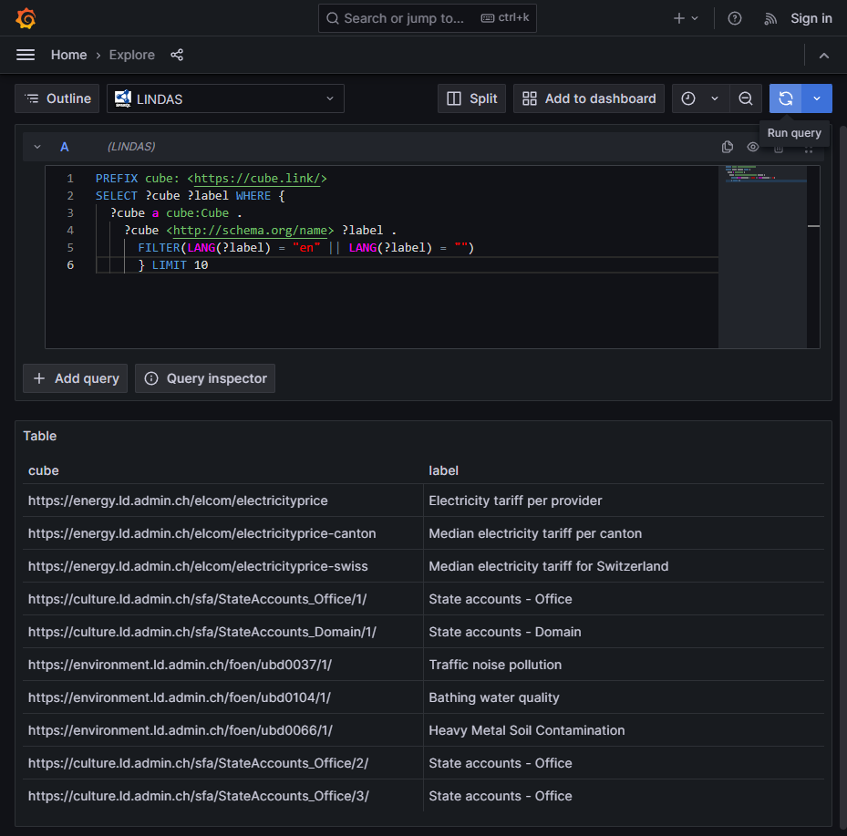

# Grafana LINDAS POC Documentation

## Overview

This proof-of-concept demonstrates using Grafana with the Flanders Make SPARQL datasource plugin to query and visualize data from LINDAS (Swiss government Linked Data Service).

## Architecture

```
+----------------+     +------------------+     +-------------------+
|    Grafana     | --> | SPARQL Plugin    | --> | lindas.admin.ch   |
|  (Port 3003)   |     | (Flanders Make)  |     | /query endpoint   |
+----------------+     +------------------+     +-------------------+
```

## Setup

### Prerequisites
- Docker and Docker Compose installed
- Port 3003 available

### Running the POC

```bash
cd grafana-lindas-poc
docker-compose up -d
```

Access Grafana at: http://localhost:3003

### Configuration

The POC includes:
- **docker-compose.yml**: Grafana container with SPARQL plugin auto-installed
- **provisioning/datasources/lindas.yml**: Pre-configured LINDAS datasource

## Testing Results

### Test Date: 2025-12-17

**Test Query:**
```sparql
PREFIX cube: <https://cube.link/>
SELECT ?cube ?label WHERE {
  ?cube a cube:Cube .
  ?cube <http://schema.org/name> ?label .
  FILTER(LANG(?label) = "en" || LANG(?label) = "")
} LIMIT 10
```

**Results:** Successfully returned 10 RDF data cubes from LINDAS:

| Cube URI | Label |
|----------|-------|
| energy.ld.admin.ch/elcom/electricityprice | Electricity tariff per provider |
| energy.ld.admin.ch/elcom/electricityprice-canton | Median electricity tariff per canton |
| energy.ld.admin.ch/elcom/electricityprice-swiss | Median electricity tariff for Switzerland |
| culture.ld.admin.ch/sfa/StateAccounts_Office/1/ | State accounts - Office |
| culture.ld.admin.ch/sfa/StateAccounts_Domain/1/ | State accounts - Domain |
| environment.ld.admin.ch/foen/ubd0037/1/ | Traffic noise pollution |
| environment.ld.admin.ch/foen/ubd0104/1/ | Bathing water quality |
| environment.ld.admin.ch/foen/ubd0066/1/ | Heavy Metal Soil Contamination |
| culture.ld.admin.ch/sfa/StateAccounts_Office/2/ | State accounts - Office |
| culture.ld.admin.ch/sfa/StateAccounts_Office/3/ | State accounts - Office |



## Limitations

### Current Plugin Limitations

The Flanders Make SPARQL plugin provides:
- Raw SPARQL query editor
- Table visualization of results
- Basic chart visualizations

**Missing compared to visualize.admin.ch:**
- No visual dataset browser/selector
- No drag-and-drop dimension selection
- Users must write SPARQL queries manually
- No automatic chart type suggestions based on data

### Potential Solutions

1. **Custom Grafana Plugin Development**: Fork the Flanders Make plugin and add:
   - Dataset discovery panel
   - Dimension selector UI
   - Query builder interface

2. **Dashboard Templates**: Create pre-built dashboards with:
   - Variable selectors for common datasets
   - Parameterized queries

3. **Alternative Tools**: Consider other solutions like:
   - Custom web application with SPARQL backend
   - Metaphactory (commercial)
   - Custom visualization layer

## Example Queries

### List All Data Cubes
```sparql
PREFIX cube: <https://cube.link/>
SELECT ?cube ?label WHERE {
  ?cube a cube:Cube .
  ?cube <http://schema.org/name> ?label .
} LIMIT 100
```

### Get Cube Dimensions
```sparql
PREFIX cube: <https://cube.link/>
PREFIX meta: <https://cube.link/meta/>
SELECT ?dimension ?label WHERE {
  <CUBE_URI> cube:observationConstraint ?shape .
  ?shape <http://www.w3.org/ns/shacl#property> ?prop .
  ?prop <http://www.w3.org/ns/shacl#path> ?dimension .
  OPTIONAL { ?dimension <http://schema.org/name> ?label }
}
```

### Get Observations
```sparql
PREFIX cube: <https://cube.link/>
SELECT * WHERE {
  ?obs a cube:Observation .
  ?obs cube:observedBy <CUBE_URI> .
  ?obs ?predicate ?value .
} LIMIT 100
```

## Conclusion

The Grafana + SPARQL plugin approach successfully connects to LINDAS and can query RDF data. However, it requires users to write SPARQL queries, making it unsuitable for non-technical users who need the visual dataset browsing experience provided by visualize.admin.ch.

For a true replacement, additional development would be needed to create a user-friendly interface layer on top of the SPARQL capabilities.
